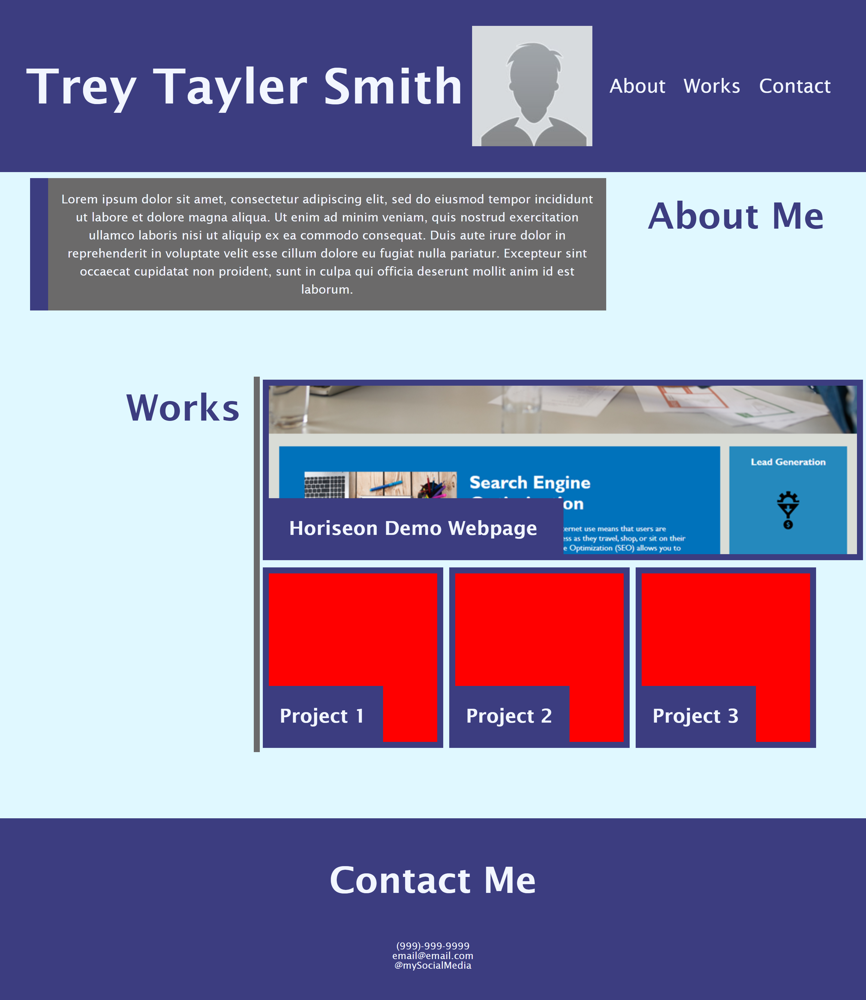

# Trey-Tayler-Smith-Portfolio

## Description

A webpage designed with HTML & CSS as a portfolio for myself. It has the ability to be updated to accomodate the growing number of projects I create.

## Installation
n/a

## Assets
Use [this link](https://treytaylersmith.github.io/Trey-Tayler-Smith-Portfolio/) to visit the page.

## Usage

To display my work and showcase my ability to use CSS to create a pleasing and effective website.

## Credits
n/a

## License

Please refer to the LICENSE in the repo.
